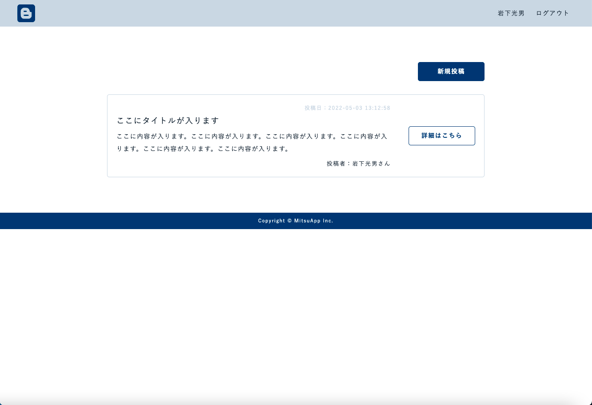

# mitsu-app

社内で誰もが投稿でき、内容について他の社員たちが自由にコメントできる簡単なアプリ

## デモ

[デモページ](http://mitsuapp.herokuapp.com/)

## 使い方

1. REGISTERで登録します（名前・メールアドレス・パスワードを入力）。
2. 新規投稿ボタンをクリックし、タイトル・内容を記述し作成します。
3. 各投稿記事の詳細はこちらをクリックすると詳細画面が表示します。
4. 詳細画面の編集をするボタンをクリックし、投稿内容を編集できます。
5. 詳細画面の削除するボタンで記事を削除できます。
6. 詳細画面のコメントをするをクリックし、その記事に対してのコメントを入力できます。

## 環境

* Laravel

## 注意事項

* 他人が不快になる内容でないこと。
* 他人の名誉を毀損し、または他人を誹謗中傷するものでないこと。
* 暴言、卑猥な表現等、公序良俗に反するものでないこと。

## 文責

* 作成者：岩下光男
* 所属：株式会社アドシン
* [E-mail：m-iwashita@e-adshin.com](m-iwashita@e-adshin.com)

## ライセンス

mitsu-app